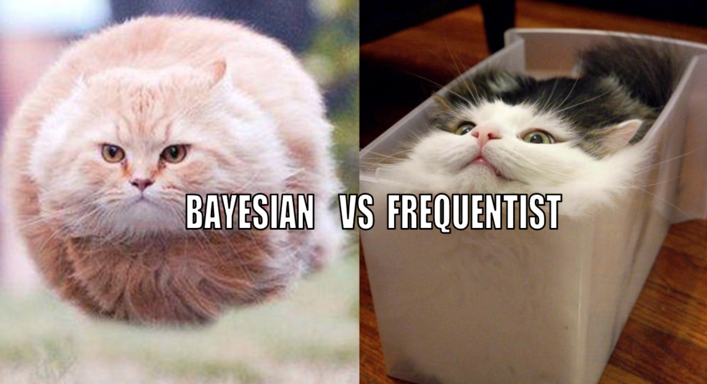
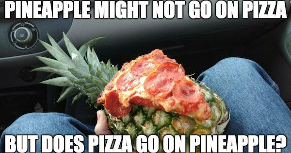

# Who am I?

.pull-left[
## Background/Interests in
- Methodology and Statistics
- Psychology
- Bayesian Inference

]

.pull-right[
## Trivia
- Traveled to 26 countries
- Served in the Air Force
- Fan of musicals & Marvel Studios
- Pineapples do not go on pizza

]

---

# What are we going to do?

## Intro to lab sessions

## Coming up with research ideas (Assignment 1)

---

# Intro to lab sessions

## Purpose

### To give you tools to complete weekly assignments

### These piecewise all work together to create your final proposal

## What can you expect?

### Short lab sessions (about 20 minutes or less)

### Advice on successfully completing the weekly assignments

---

# Intro to lab sessions

## Are you ready?

---

# Coming up with research ideas

## A big picture about psychology and research question

### What is psychology? (PSY001)

--

- ### Scientific study on how people think, feel, and behave

- ### Research questions across various subdisciplines

--

### How do we study research questions in psychology? (PSY010 and PSY015)

--

- ### Statistical methods

- ### Variables and relationships between them

---

# Coming up with research ideas

## Example 1

### Are you a graduate student?

## Is this a strong and workable psychological research question?

--

### Not about how people think, feel, and behave

### Not concerned with relationships between variables

### A better version would be "Is being a state of graduate students associated with psychological well-being?"

---

# Coming up with research ideas

## Example 2

### Do therapies work?

## Is this a strong and workable psychological research question?

--

### Too broad... Which therapies? What do you mean by 'work'?

### A better version would be "Does going through cognitive-behavioral therapy sessions increase self-esteem?"

---

# Coming up with research ideas

## Example 3

### What is the impact of extreme temperatures and material density on the room-temperature superconductor?

## Is this a strong and workable psychological research question?

--

### Is not psychological in nature...

### Is not workable with methods and statistics that psychologists typically use

---

# Coming up with research ideas

## Tips on coming up with research ideas

### Start from psychological phenomena you are interested in   (social, cognitive, health, educational, developmental, cultural, clinical, quantitative, etc.)

### Which specific thoughts, behaviors, or feelings do you want to focus on?

### Identify specific and measurable (either directly or indirectly) variables and think about relationships between them

### What are the independent variable (IV) and the dependent variable (DV)?   IV (aka. predictor): A variable researchers manipulate/change; assumed to affect the DV   DV (aka. outcome): A variable being tested and measured; dependent on the IV

---

# Coming up with research ideas

## An example from Steinmetz et al. (2016)

### Start from psychological phenomena you are interested in   I am interested in human behavior within the social context (i.e., social psychology)

### Which specific thoughts, behaviors, or feelings do you want to focus on?   social cognition, presence of others, self-perception

### Identify specific and measurable variables and think about relationships between them   Being observed or not, eating behavior, and maybe the relationship between these two?

### What are the independent variable and the dependent variable?   IV: being observed or not; DV: eating behavior

---

# Coming up with research ideas

## Other examples?

### Does taking daily nature walks improve high school students' academic achievement?   IV: exposure group (those who talk in nature vs. control); DV: academic performance

### Can exposure to bright colors affect blood pressure in healthy adults?   IV: exposure to bright colors or not; DV: blood pressure

### Are K-pop tastes related to introversion or extroversion in young adults?   IV: favorite type of K-pop; DV: level of introversion or extroversion

---

# Coming up with research ideas

## Assignment 1 rubrics

### Should be something academically interesting (i.e., new contribution, different perspective)

### Should be psychological, clear, workable, and something about relationships between variables

### Should identify the independent variable and the dependent variable

### Should be **three research ideas** and **choose one out of three you want to work with**!

---

# Coming up with research ideas

## Assignment 1 formats

### Type this assignment and include your name and student ID

### PDF format only

## Assignment 1 deadline

### Due at 9 am on September 6

### No late work will be accepted except for extreme or emergent circumstances

---

# Before you go home...

## Give instructions!

## Any questions or comments?

---

# Thanks! Have a good one!

---

# References

Steinmetz, J., Xu, Q., Fishbach, A., & Zhang, Y. (2016). Being observed magnifies action. *Journal of Personality and Social Psychology, 111*(6), 852–865. https://doi.org/10.1037/pspi0000065