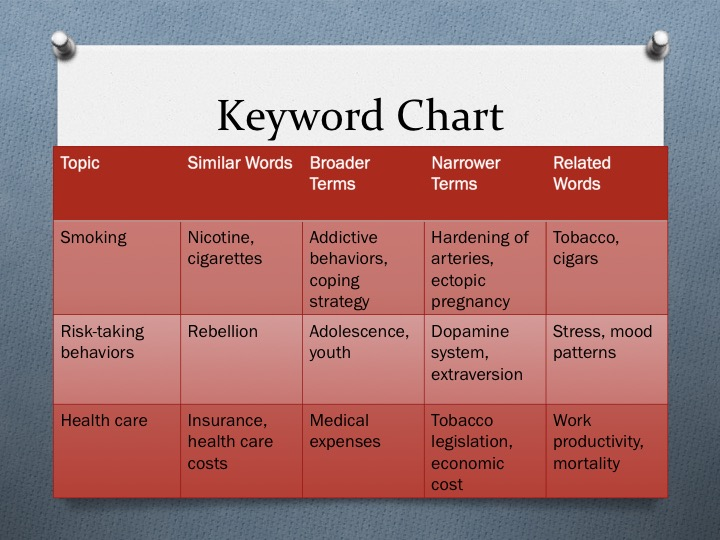

# What are we going to do?

## Proposal articles (Assignment 2)

### Why are we doing this?

### How to find relevant articles?

### Assignment 2 rubrics

---

# A big picture

## Conducting psychological research

### What is psychology?

### Which psychological phenomena are you interested in?

### Which specific variables will you measure?

### What are the relationships between those variables?

### What are IVs and DVs?

## These are what you did in assignment 1 :)

---

# A big picture

## What is the next step?

### Show the relevance and importance of your research idea

### Find ***peer-reviewed*** articles

- ### What is known thus far in the field?

- ### What is missing in the literature?

- ### What can you contribute by conducting your psychological research?

### Provide those articles using ***APA style***

---

# A big picture

## Scientists, welcome to the world of peer-review!

---

# Proposal articles

## How to find peer-reviewed articles?

### Random googling: Think about keywords!

---

# Proposal articles

## How to find peer-reviewed articles?

### Random googling: Where to search?

- ### PsycINFO from https://libguides.ucmerced.edu/az.php

- ### Google Scholar https://scholar.google.com/

- ### Some searching tips: Using quotation marks!

## Show how to do this...

---

# Proposal articles

## How to find peer-reviewed articles?

### Reading papers

- ### Focus on Introduction

- ### Focus on Discussion

## Show how to do this...

---

# Proposal articles

## How to find peer-reviewed articles?

### Ask people

- ### Professors

- ### Applied researchers (in academia or industry)

- ### Graduate students

---

# Proposal articles

## How to provide peer-reviewed articles you found?

## APA style (7th edition)

### See also https://apastyle.apa.org/style-grammar-guidelines/references/examples/journal-article-references

---

# Proposal articles

## How to provide peer-reviewed articles you found?

## Manually formating every reference is a bit tedious...   Consider using...

- ### Google Scholar (But be careful! It is not complete!)

- ### LaTeX/Overleaf

- ### Zotero/EndNote/Mendeley

## Show how to do this...

---

# Proposal articles

## Assignment 2 rubrics

### Type your research idea and its IV/DV

### Provide five articles (not books but peer-reviewed papers published in journals!)

- ### Provide article references using APA style

- ### Copy and paste abstracts for each reference

## Show CatCourses...

---

# Proposal articles

## Assignment 2 formats

### Type this assignment and include your name and student ID

### PDF format only

## Assignment 2 deadline

### Due at 9 am on September 13

### No late work will be accepted except for extreme or emergent circumstances

---

# Before you go home...

## Any questions or comments?

---

# Thanks! Have a good one!

