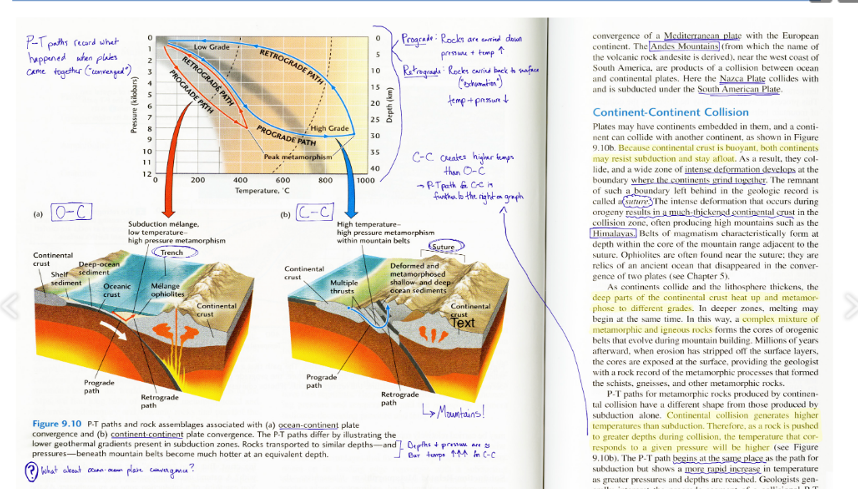

# What are we going to do?

## Main article summary (Assignment 3)

### Why are we doing this?

### How to study articles?

### Assignment 3 rubrics

---

# A big picture

## Conducting psychological research

### Finding psychological research questions (assignment 1)

### Finding relevant articles (assignment 2)

---

# A big picture

## What is the next step?

### Read related articles

- ### How did past research conduct studies?

- ### What did past research find?

- ### How can you extend previous findings?

### Time to enjoy studying the articles

---

# A big picture

## Do you like reading articles?

---

# A big picture

## Do you like reading articles?

---

# Main article summary

## How to study peer-reviewed articles?

### Pieces of a typical article

- ### Title: topic and information about the authors

- ### Abstract: brief overview of the articles

- ### Introduction: background information and statement of research hypotheses

- ### Methods: Details of how the study was conducted, instruments used, variables measured

---

# Main article summary

## How to study peer-reviewed articles?

### Pieces of a typical article

- ### Results: All the data of the study along with figures, tables, and/or graphs

- ### Discussion: The interpretations of the results and implications of the study

- ### References: Citations of sources from where the information was obtained

---

# Main article summary

## How to study peer-reviewed articles?

### So, do I read from page 1 to page 999?

### Take it easy! Don't overwhelm yourself to understand everything

### Condense and paraphrase what you read using your own language

### Be interactive; taking notes, annotating, finding resources, etc.

---

# Main article summary

## Assignment 3 rubrics

### From assignment 2, select the most relevant article (only one article)

### Provide APA-style reference of that paper

### Summarize the paper using the **template**

 

## Show CatCourses...

---

# Main article summary

## Assignment 3 formats

### Type this assignment and include your name and student ID

### PDF format only

## Assignment 3 deadline

### Due at 9 am on September 20

### No late work will be accepted except for extreme or emergent circumstances

---

# Before you go home...

## Any questions or comments?

---

# Thanks! Have a good one!

