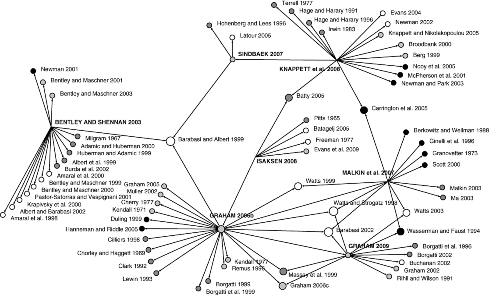

# What are we going to do?

## Article with notes (Assignment 4)

### Why are we doing this?

### Assignment 4 rubrics

---

# A big picture

## Conducting psychological research

### Finding psychological research questions (assignment 1)

### Finding relevant articles (assignment 2)

### Reading and summarizing relevant articles (assignment 3)

---

# A big picture

## What is the next step?

### Read ***more*** related articles

- ### What did you particularly like about articles?

- ### Can you find any connections between articles?

- ### Can you make a storyline?

---

# A big picture

## Research articles are connected

---

# Article with notes

## How to study peer-reviewed articles?

### Pieces of a typical article

- ### Title: topic and information about the authors

- ### Abstract: brief overview of the articles

- ### Introduction: background information and statement of research hypotheses

- ### Methods: Details of how the study was conducted, instruments used, variables measured

---

# Article with notes

## How to study peer-reviewed articles?

### Pieces of a typical article

- ### Results: All the data of the study along with figures, tables, and/or graphs

- ### Discussion: The interpretations of the results and implications of the study

- ### References: Citations of sources from where the information was obtained

---

# Article with notes

## Introduction: What is the purpose of the article?

### What specifically is the article addressing?

### Why is this an interesting or worthwhile topic/phenomenon to research?

### What is already known about this topic/phenomenon?

### What are the gaps in contemporary knowledge or understanding of this topic/phenomenon?

### What were the IVs and DVs?

---

# Article with notes

## Method: What research techniques are used by the author(s)?

### Who constitutes the sample? Size? Characteristics?

### What is the procedure?

### Which statistical methods were used?

### Are measures reliable/valid?

---

# Article with notes

## Results: What did the researchers find

### How do the results relate to the predictions/hypotheses set out in the introduction?

### Are hypotheses supported or not?

### Are the results reported and analyzed in an unbiased manner?

### Did authors use tables/figures to efficiently present the findings?

---

# Article with notes

## Discussion: How do the authors interpret the findings?

### Do the authors discuss implications of their findings for theory, or for the real world?

### What suggestions are being made about future research into this topic/phenomenon?

### What limitations does the study have?

### If you were an author, what could have been additionally said?

---

# Article with notes

## Assignment 4 rubrics

### Choose four additional articles (from assignment 3 or new)

### Provide your research question

### Provide APA-style reference of that paper

### Summarize the paper based on major results/key findings and other information

## Show CatCourses...

---

# Article with notes

## Assignment 4 formats

### Type this assignment and include your name and student ID

### PDF format only

## Assignment 4 deadline

### Due at 9 am on October 4

### No late work will be accepted except for extreme or emergent circumstances

---

# Before you go home...

## Any questions or comments?

---

# Thanks! Have a good one!

