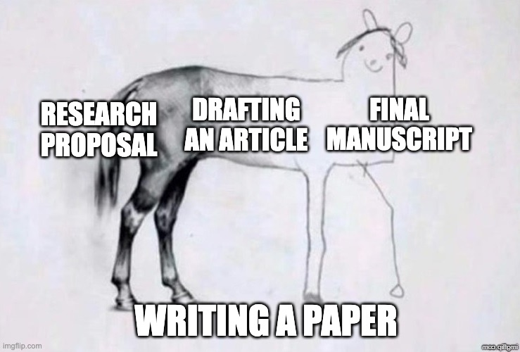
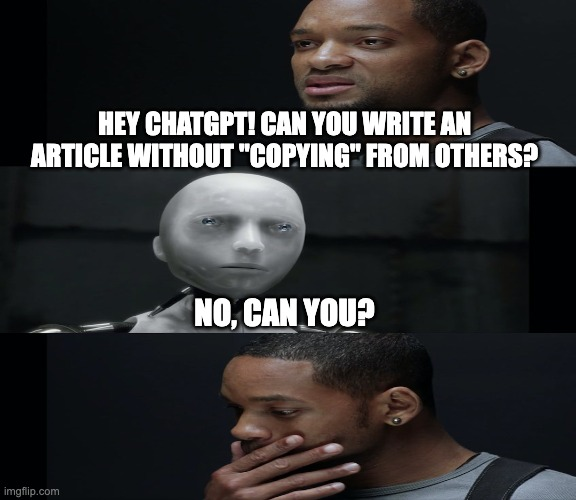
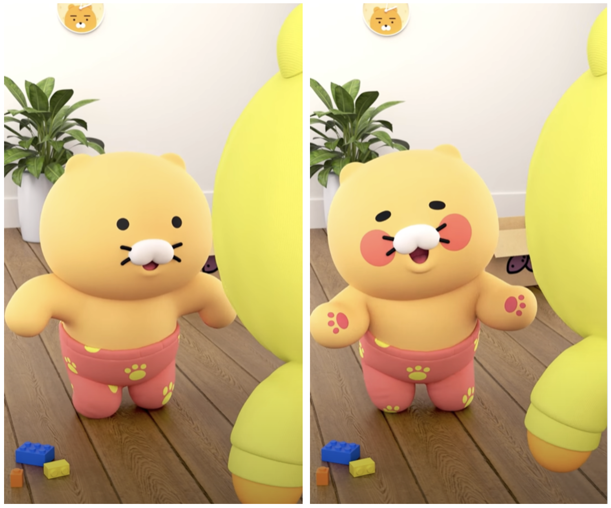

# What are we going to do?

## Introduction and references sections (Assignment 6)

### A big picture

### Assignment 6 rubrics

### Writing tips

---

# A big picture

## Conducting psychological research

### Asking psychological research questions (Assignment 1)

### Reviewing relevant articles (Assignment 2)

### Reading and summarizing relevant articles (Assignments 3 and 4)

### Operationalizing and measuring variables (Assignment 5)

---

# A big picture

## What is the next step?

### Writing!

- ### Consider it like preparing a manuscript for journal submissions :)

- ### Can you advertise and promote your research through academic writing?

- ### Can you craft a captivating story for your introduction section?

---

# A big picture

## Do you enjoy writing?

---

# Introduction & references sections

## Assignment 6 rubrics

### Submitting 3 pieces of your research proposal

- ### Title page: 1-page

- ### Introduction section: at least 800 words   (3 to 3.5 pages when following APA formatting,   e.g., Times New Roman 12pt, double-spaced, and 1-inch margins)

- ### Reference section: Must have at least 5 references

### **I made a template for you! See CatCourses!**

---

# Introduction & references sections

## Assignment 6 rubrics

### What is important?

- ### Proper in text citations

- ### Writing style (grammar, clarity, formality, etc.)

- ### APA formatting for references

### Go through the rubrics document on CatCourses together...

---

# Introduction & references sections

## Writing tips on the title page

### Insert 3 to 4 line breaks before providing the information

### Think about an academically interesting title!

### Bold the title

### Page number

### Center the text

---

# Introduction & references sections

## Writing tips on the title page

### Refer to APA 7th sample student papers

- ### https://apastyle.apa.org/instructional-aids/student-paper-setup-guide.pdf

- ### https://owl.purdue.edu/owl/research_and_citation/apa_style/apa_formatting_and_style_guide/documents/APA%207%20Student%20Sample%20Paper.pdf

### Explain how to do in Word...

---

# Introduction & references sections

## Writing tips on the introduction section

### Introduction is presumably the most time-consuming because of its importance

### Purpose is to introduce the research topic (Assignment 1)

### Review relevant studies and discuss theories (Assignments 2, 3, 4)

### State your hypothesis for the outcome of your study (Assignments 5)

---

# Introduction & references sections

## Formatting is important!

- ### 1-inch margins to top/bottom/left/right

- ### Times New Roman 12pt

- ### Double-spaced

- ### At least 800 words (3 to 3.5 pages)

- ### In-text ciations, i.e.,   Narrative citation and parenthetical citation

---

# Introduction & references sections

## Writing tips on the introduction section

### In-text citation for crediting previous research

### Paraphrase the previous findings and put in-text citations

- ### Narrative citation

- ### Parenthetical citation

---

# Introduction & references sections

## Say we have the following references

### Heo, I. (2023). On the beauty of conducting psychological research. *Journal of Psychology, 3*(1). 355-365. https://doi.org/1080.3871/as35.aw52/s348

### Heo, I., & Ramirez, J. (2023). Developemtnal theories of personality. *Personality Science, 3*(6). 1-6. https://doi.org/2525.126/w3ag25/fasr.2344

### Heo, I., Mello, L., & Yeung, J. (2023). Bayesian approach to measuring propaganda. *American Journal of Psychometrics, 1*(20). 64-88. https://doi.org/261.sg2380/5982/ga112

### Hindshaw, A. (2021). Psychology of writing. *Review of Creative Psychology, 16*(1). 827-921. https://doi.org/50.8672/283701g/239aa145/s

---

# Introduction & references sections

## Narrative citation

### Heo (2023) said that conducting psychology can uncover hidden mechanisms in the human mind.

### Heo and Ramirez (2023) explained the developmental stages of personality.

### Heo et al. (2023) applied the Bayesian framework to political propaganda.

### Heo et al. (2023) and Hindshaw (2021) both emphasized the importance of writing in conducting research.

---

# Introduction & references sections

## Parenthetical citation

### Mechanisms on how humans think can be solved by conducting research (Heo, 2023).

### Theories of personality development were surveyed (Heo & Ramirez, 2023).

### The Bayesian approach has been proven to be useful in studying propaganda (Heo et al., 2023).

### The importance of writing has been emphasized in the literature (Heo et al., 2023; Hindshaw, 2021)

---

# Introduction & references sections

## Writing tips on the introduction sections

### Consider adding paragraphs about:

- ### Gentle intro to topic
- ### Previous work on the topic
- ### What is missing and why important to fill this gap
- ### Contribution of your work
- ### Research question/hypothesis

---

# Introduction & references sections

## Writing tips on the introduction sections

### Avoid plagiarism! Wise use of ChatGPT!

---

# Introduction & references sections

## Writing tips on the references section

### Bold the word 'References' on top

### Arrange articles alphabetically by the first author's last name

### What if the author(s) have multiple publications on the same year?

- ### Differentiate references by putting alphabets after the publication year   based on the article titles

---

# Introduction & references sections

## Assignment 6 formats

### APA formatting for the introduction and references sections

### 1-inch margin, Times New Roman 12pt, double spacing, APA style citations

## Assignment 6 deadline

### Due at 9 am on October 25

### No late work will be accepted except for extreme or emergent circumstances

---

# Before you go home...

## Lab sessions next week

### No new content but I will stay in the lecture room

### Prepare your questions if any

 

## Any questions or comments?

---

# Thanks! Have a good one!

