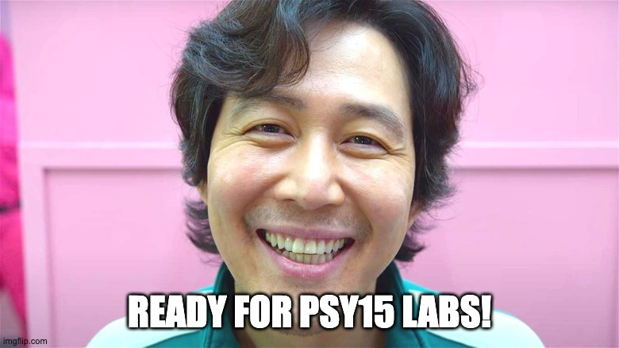

# Two more labs to go, including today!

## How are you?

---

# What are we going to do?

## Method section (Assignment 8)

### A big picture

### Assignment 8 rubrics

### Going through the steps together

---

# A big picture

## Conducting psychological research

### Asking psychological research questions (Assignment 1)

### Reviewing and summarizing relevant articles (Assignments 2, 3, and 4)

### Operationalizing and measuring variables (Assignment 5)

### Writing the introduction (Assignment 6)

### Preparing measures (Assignment 7)

---

# A big picture

## What is the next step?

### Writing more!

- ### Writing the Methods section, part 2

- ### Describe how you will collect responses

---

# Method section

## Purpose of a methods section

### Describe your study so well that someone would be able to replicate your study

### Be very specific in your descriptions

---

# Method section

## Assignment 8 rubrics

### Submitting the actual method section

- ### Title page

- ### Participants

- ### Measures

- ### Procedure

---

# Method section

## Title page

### Insert 3 to 4 line breaks before providing the information

### Title

### Bold the title

### Page number

### Center the text

---

# Method section

## Participants

### Who your participants would include

### How many? From where? What age group? Etc.

### Be specific!

---

# Method section

## Measures

### Describe any measures/instruments you would use and cite sources

### How you are going to measure each - and EVERY – variable

---

# Method section

## Procedure

### Describe exactly how you would collect data

### What is the design of your study and how exactly will you carry it out?

### What will you tell participants?

### In what order will you give the surveys?

### What does the participant experience from the beginning to the end of a data collection session?

---

# Method section

## Let's go through the rubrics together!

### Template

### Sample work of a student

### Examples of published papers

### See CatCourses (students' view)

---

# Method section

## Assignment 8 formats

### Follow the APA style

 

## Assignment 8 deadline

### Due at 9 am on November 15

### No late work will be accepted except for extreme or emergent circumstances

---

# Before you go home...

## Any questions or comments?

---

# Thanks! Have a good one!

