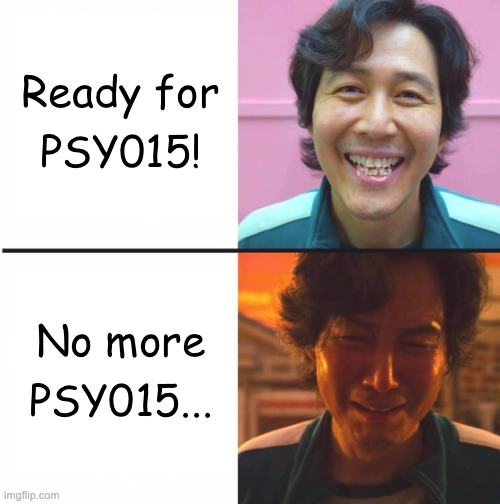
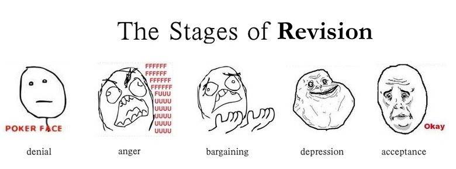
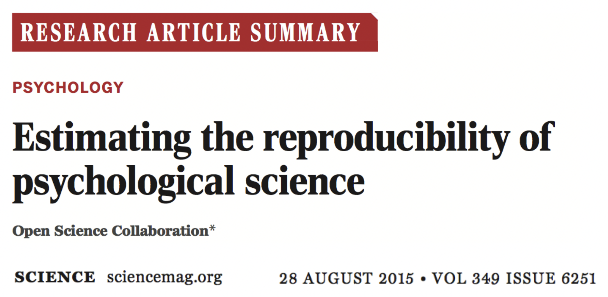
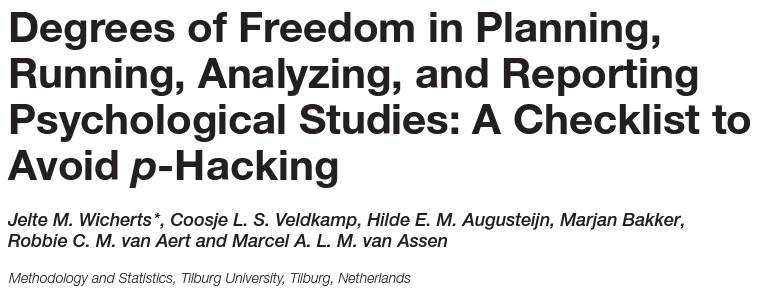
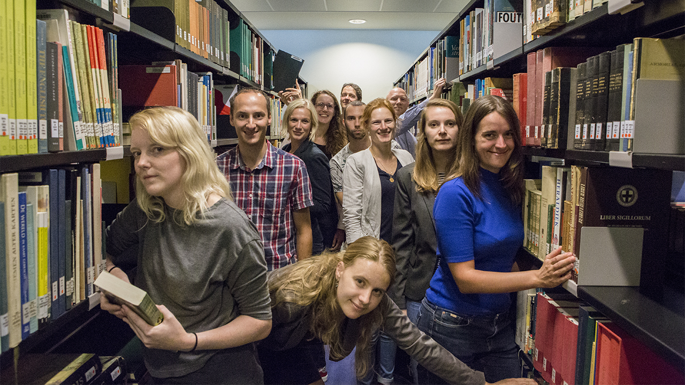
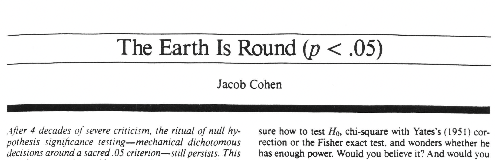
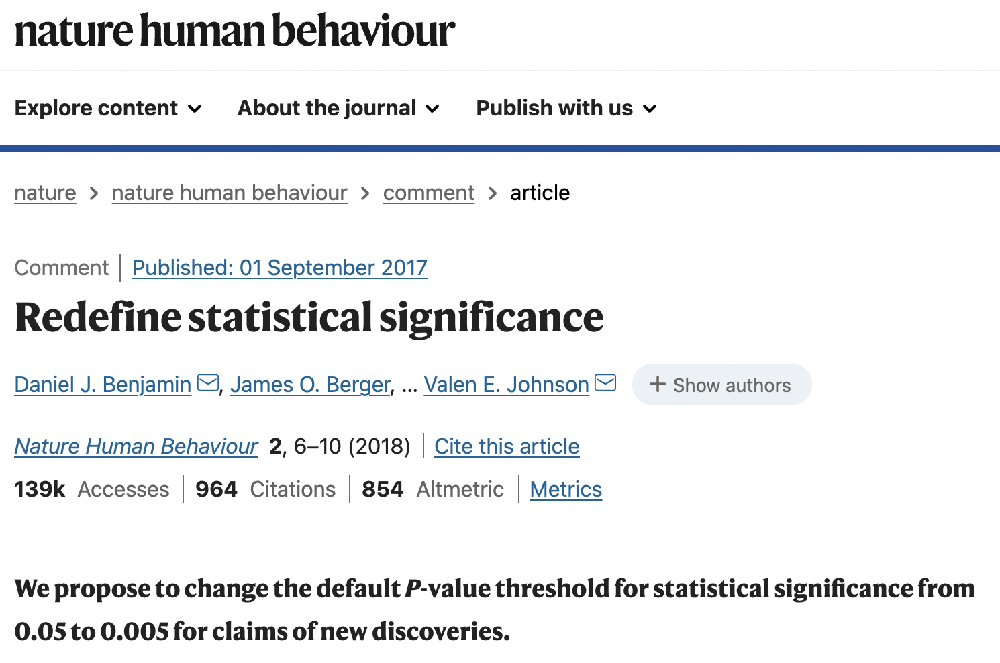
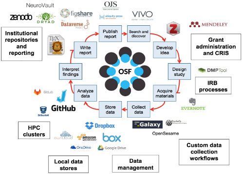
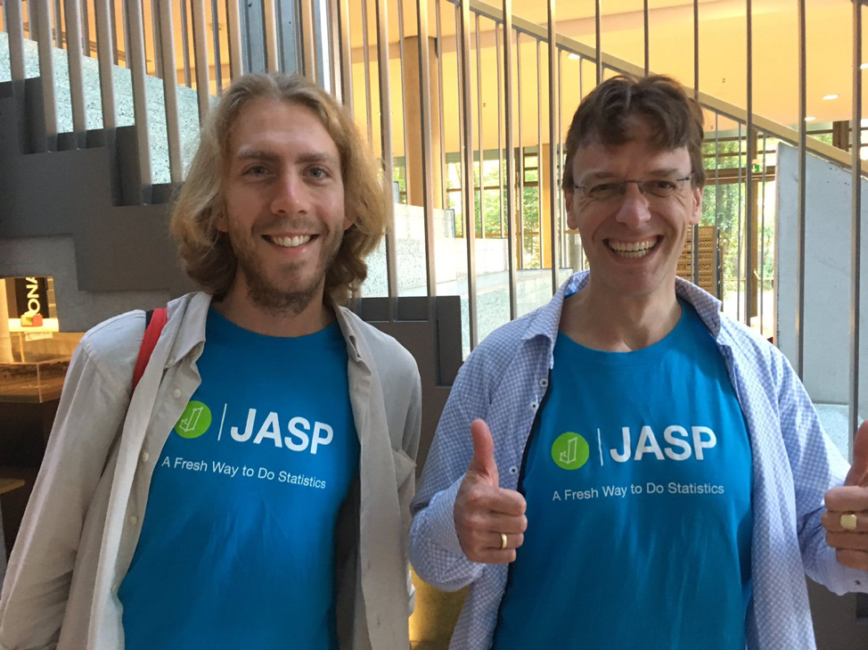
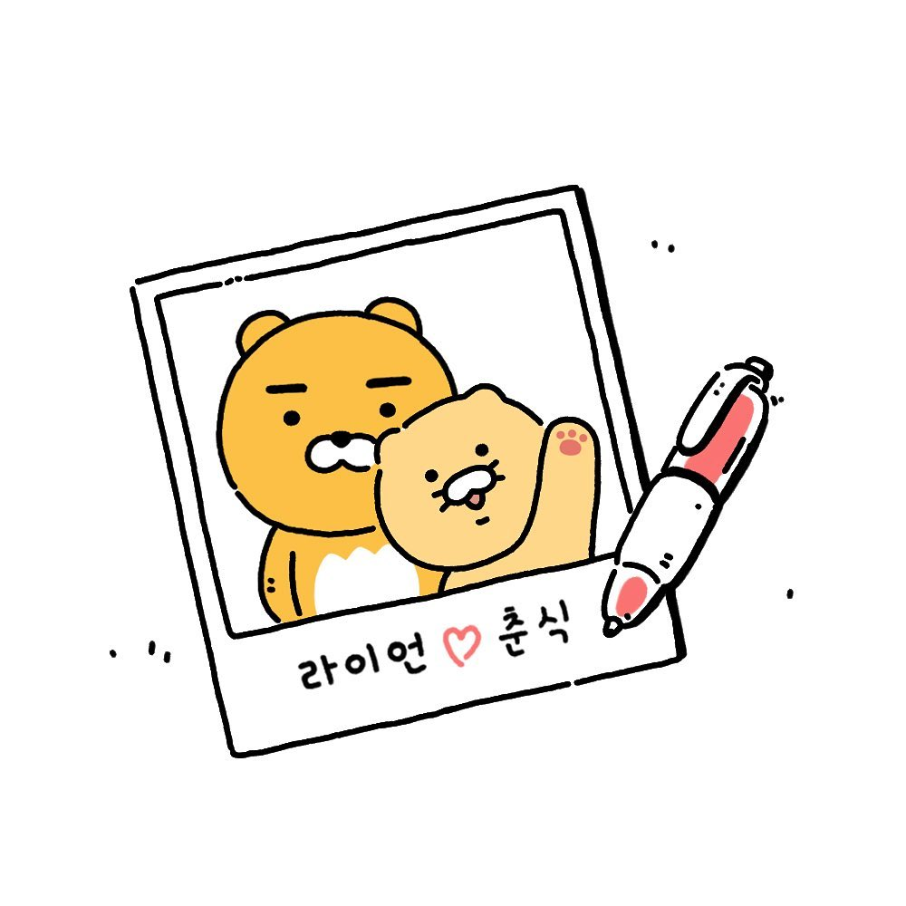

# Today is our final lab!

## How are you?

---

# What are we going to do?

## Submission of the entire proposal (Assignment 9)

### A big picture

### Assignment 9 rubrics and tips

 

## Beyond methods and statistics: Metascience

---

# A big picture

## Conducting psychological research

### Asking psychological research questions (Assignment 1)

### Reviewing and summarizing relevant articles (Assignments 2, 3, and 4)

### Writing the introduction section (Assignment 6)

### Writing the methods section (Assignments 5 and 7)

---

# A big picture

## What is the next step?

### Combine all together based on comments/feedback

- ### Response letters

- ### Revise the title page, intro, method, references, and appendix 

---

# A big picture

## Revision is painful!

---

# Submission of the entire proposal

## Assignment 9 rubrics

### How to submit the entire proposal

- ### Response letter (5pt)   State how you addressed the comments/feedback about all five sections

- ### Entire proposal (5pt)   Include revised title, intro, methods, references, and appendix

### Format and deadline

- ### Follow the APA style and due at 9 am on November 29 (No late work will be accepted)

---

# Submission of the entire proposal

## Response letter (5pt)

### Purpose is to mimic the journal submission process

### Summarize my comments/feedback for five components

### Explain how you addressed my comments/feedback

 

## Show an example...

---

# Submission of the entire proposal

## Entire proposal (5pt)

### Combine all five components in the order of...

- ### Title, intro, methods, references, and appendix

### Again, be sure to follow the APA 7th formatting

 

## Show an example...

---

# Metascience

## Beyond psychological methods and statistics

### We have learned methods (PSY015) and statistics (PSY010)

### So any psychological research would be perfect and rigorous, do you agree?

---

# Metascience

## The replication crisis in psychology

### Only 36% of the significant findings were replicable

---

# Metascience

## Researcher degrees of freedom

### Inherent flexibility in conducting research and analyzing its results

.pull-left[

]

.pull-right[

]

---

# Metascience

## Questionable research practices to obtain significant p-values

---

# Metascience

## A movement to redefine or ban the p-value

---

# Metascience

## Stop using p-values!

### Prof. Dr. Rens van de Schoot (https://www.youtube.com/watch?v=owb5A8lVS0o)

.pull-left[

]

.pull-right[
<iframe width="600" height="270" src="https://www.youtube.com/embed/owb5A8lVS0o" frameborder="0" allow="accelerometer; autoplay; encrypted-media; gyroscope; picture-in-picture" allowfullscreen></iframe>
]

---

# Metascience

## Open science movement

.pull-left[

]

.pull-right[

]

---

# Concluding remark

## What I want to convey to you...

### Be critical in doing everything in your life

### Be transparent in doing science

### Enjoy your undergraduate life (jealous of you!)

---

# Before you go home...

## Any ***FINAL*** questions or comments?

---

# Thank you for the great semester! Cheers!

## Happy Thanksgiving!

